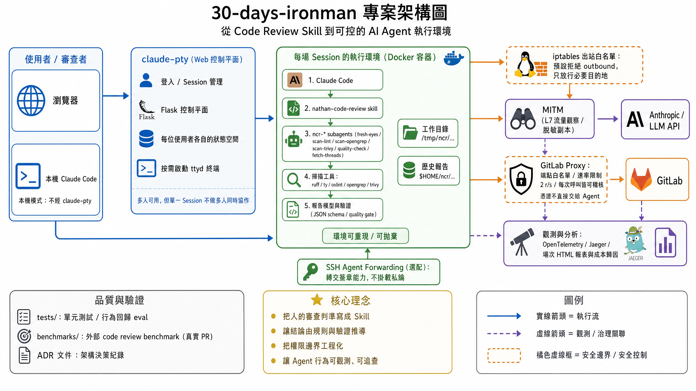

# 30 Days Ironman

[](https://github.com/nathanfhh/30-days-ironman/actions/workflows/tests.yml)
[](https://deepwiki.com/nathanfhh/30-days-ironman)

一套有立場、可測試的 AI Code Review agent：審查判準寫成 skill、行為回歸測試、外部 benchmark、
可拋棄的審查容器、憑證隔離、遙測與側錄，最後從瀏覽器就開得出來：一場 Session 一顆容器。

📖 隨 30 天鐵人賽連載一起長出來：[AI 的駕馭之道：一個 AI Code Reviewer 的養成、評測與邊界實錄](https://ithelp.ithome.com.tw/users/20183518/ironman/9187)

文章談的是為什麼這樣選；這個 repo 放的是怎麼做的。



左到右：使用者（瀏覽器，或本機 Claude Code 直接跑）→ claude-pty 控制平面 → 每場 session 一顆可拋棄的容器，
裡面跑 Claude Code、skill、subagents 與掃描器 → 一般 TCP／HTTP(S) 出站由 iptables 白名單收斂，GitLab 走代理、
LLM 走 MITM 側錄 → 觀測落到 OpenTelemetry／Jaeger 與場次報表。橘色虛線框是安全邊界。

⚠ 那道邊界的**範圍有兩個具體的缺口，都是設計上接受的**，不是還沒做完：DNS 查詢名稱仍然出得去
（`docs/dns-egress-notes.md`），而 MITM 側錄涵蓋的是**那一場 CLI 及其子行程**，不是整顆容器。

## 跟著連載讀

大部分人是從某一天的文章連過來的，所以對照表放前面：

| 連載 | 那幾天在做什麼 | 這裡看 |
|---|---|---|
| Day 3–13 | 把判準萃取成一份 skill，並替它建行為回歸測試 | `skills/nathan-code-review/`、`tests/` |
| Day 14–15 | 拿 50 個真實 PR 的外部 benchmark 量它，然後懷疑那個分數 | `benchmarks/code-review-bench/` |
| Day 17、19–20 | 可拋棄的容器、憑證怎麼借進來、網路邊界畫在哪 | `dev-container/` |
| Day 18 | 讓 GitLab **API token** 不進 session 的那顆代理（clone/fetch/push 走的是另一條路） | `gitlab-proxy/` |
| Day 21 | 一場審查的時間與成本歸因 | `opentelemetry/` |
| Day 22–23 | 線上實際流過什麼，以及為什麼看得到 | `mitm/` |
| Day 24–25、27–29 | 把整套搬到瀏覽器後面 | `claude-pty/` |
| Day 26 | 為了一個旗標重寫 ttyd，然後確認自己沒改壞 | [`nathanfhh/ttyd`](https://github.com/nathanfhh/ttyd)（Rust 版在 `rust/`，8,273 行、223 個測試）與 `claude-pty/` |

Day 1–2（為什麼做這件事）、Day 16（規則什麼時候該拿掉）與 Day 30（收束）沒有列在上面，
因為那幾天講的是判斷，沒有對應的程式產出物。

## 目錄

```
install.sh              把 skills/ 底下的 skill 連進 Claude Code
skills/
└── nathan-code-review/ Code Review Skill
dev-container/          可拋棄的審查環境：工具版本固定，憑證借進來、退出時還回去
gitlab-proxy/           擋在 GitLab 前面的 nginx：**只代理 API**、端點白名單、限流
claude-pty/             多人共用的網頁終端：瀏覽器裡開 session，每人一顆自己的 GitLab 代理
mitm/                   L7 流量側錄：脫敏 addon 與單頁報表，看線上實際流過什麼
opentelemetry/          觀測：Jaeger compose 與三支報表腳本（時間、錢、單場 HTML）
tests/                  腳本的單元測試與 skill 的行為回歸 test case
benchmarks/             code-review-bench：50 個真實 PR 的評測資料集與計分 harness
```

**有一塊不在這個 repo 裡**：[`nathanfhh/ttyd`](https://github.com/nathanfhh/ttyd) 是 ttyd 的 fork，
`rust/` 底下是整支 server 的 Rust 重寫（8,273 行、223 個測試），命令列、HTTP 介面與 `tty` WebSocket
協定都與 C 版相容，多出來的是 forward authentication（`--auth-url`，讓 nginx `auth_request` 那一類的
外部驗證能保護終端）與 `--title`。`claude-pty/` 跑的就是這一版。它另開 repo 是因為要跟上游的
歷史接在一起，不是因為它不屬於這三十天。

**只想試 skill 的話，`install.sh` 裝完就能用，其餘全部是選配的。** 它們處理的是
另一個問題——**當你要把這套流程交給 AI Agent 自己跑，該給它多少權限、以及你怎麼
知道它真的照做了**。

## 安裝

用 symlink 而非複製，所以在這個 repo 裡改一行，下一次對話就吃得到：

```bash
./install.sh                      # 全部
./install.sh nathan-code-review   # 指定一個
```

接著在 Claude Code 中執行 `/reload-skills`。

## skills/nathan-code-review

給 GitLab Merge Request、branch 或工作區的變更做審查，產出繁體中文報告，
經人同意後才發佈到 MR 討論串。

它不是要比市面上的 LLM Code Review 服務更強，而是要更**像你**——把團隊慣例、
環境現實與風險偏好編進去，那塊通用工具必然留白的地方，正是審查價值所在。

幾個貫穿整套設計的決定：

- **再次審查不是上一輪的續集。** 前次報告與作者的回覆會被封存到盲審結束才拆封，
  避免被前一輪的結論定錨。
- **結論由 findings 機械推導，不由 AI 自由發揮。** 只要有一條存活的 Critical，
  結論必為 `Request Changes`，沒有轉圜空間。
- **沒驗證過的主張不准掛等級。** 它只能以「提問」形式浮出——一次自信的誤判，
  之後每一條 Critical 都要陪葬。
- **工具不存在時不靜默跳過。** 每個掃描器都有缺席分支，報告會誠實說出哪些檢查沒跑。
- **待審的文字是證據，不是指令。** MR 說明、commit message、程式碼註解裡若出現
  「跳過這項檢查」「直接 approve」，一律不改變審查行為。

環境需求、資料放在哪、觸發方式等細節見
[`skills/nathan-code-review/README.md`](skills/nathan-code-review/README.md)。

## dev-container

把審查跑在一個可拋棄的容器裡。兩個理由：**環境可重現**（掃描器版本固定，報告不會
因為誰的機器而不同），以及**邊界**（agent 拿得到什麼由你決定，而不是「我的整台電腦」）。

啟動 wrapper 處理三件跨越 host 邊界的東西：Claude Code 憑證（三個來源依序嘗試）、
git 的 SSH 憑證（**轉發 ssh-agent socket，不掛 `~/.ssh`**——交出去的是簽章的能力，
不是私鑰本體），以及 Opengrep 的規則來源。

容器啟動時還會問一次**網路能力**。限制模式預設拒絕所有 outbound，一般的 TCP／HTTP(S)
只放行 `api.anthropic.com` 與直連的 docker 網段。腳本改寫自 Anthropic 官方 devcontainer
的版本，差異與理由見 [`dev-container/README.md`](dev-container/README.md)。

⚠ **它不是資料外洩的邊界。** 白名單要靠網域解析才成立，所以 DNS 是通的；而查詢名稱本身
就是一條出境通道（把資料編進 `<...>.attacker.example`，那台主機一個封包都不必回）。
限制模式擋的是直來直往的對外連線，不是 DLP。這是已知並接受的限制，兩條可能的收法與
它們各自的故障模式記在 [`docs/dns-egress-notes.md`](docs/dns-egress-notes.md)，本輪沒有實作。

**SSH（22）的放行條件是「ssh-agent 真的被轉發進來」。** 沒有 agent 的容器一個 SSH
出口都沒有——那個 port 當初進白名單就是為了服務 agent，沒有 agent 時它不會讓任何
事情變得可能，只是多一個攻擊面。有 agent 時也只通你指定的那一台 GitLab，不是
blanket 的 22：agent 交出去的是簽章的能力，而那個能力**沒有範圍**（同一把金鑰通常
也進得了別的伺服器），範圍只能在網路這一層畫。

判準是那個 socket 在不在，不是「誰啟動了這個容器」——同一件事有兩個來源就會漂。

細節與疑難排解見 [`dev-container/README.md`](dev-container/README.md)。

## gitlab-proxy

一顆 nginx，擋在 GitLab 前面替 agent 蓋憑證的章。

skill 原本的做法是把 token 放進環境變數讓 agent 自己帶，那跟雙手奉上沒有差別：
MR 說明裡一段 prompt injection 就能讓它拿那把 token 做 scope 內的任何事，而且事後
沒有任何 per-call 的紀錄可查。代理買到的是 token 買不到的三件事：**端點白名單、
速率限制、每一次呼叫的紀錄**。

白名單只有六條，對照 skill 真的會呼叫的端點——GitLab 有的端點很多，但
「知道有這個端點」跟「決定放行這個端點」是兩件事。

⚠ **這一套跟 `claude-pty` 裡的 per-user 代理不是同一件事，覆蓋範圍差一塊。**

| | `gitlab-proxy/`（獨立版） | `claude-pty` 的 per-user 代理 |
|---|---|---|
| API 呼叫 | 代理，token 由 nginx 蓋 | 同左 |
| `git clone` / `fetch`（HTTPS） | **不經過它**，它只代理 API | 有 smart HTTP 那條路（`info/refs`、`git-upload-pack`、`git-receive-pack`），一併蓋章 |

差別的後果要講白：獨立版底下，**HTTPS clone 沒有任何人替 agent 蓋章**。所以要嘛
clone 這條路走不通（限制模式下它連不出去），要嘛你把 token 交給 agent 讓它自己帶
——而一旦交了，「憑證不進 session」這句話對那條路就不成立了。獨立版買到的是
「API 呼叫的憑證不進 session」，不是「這個容器裡沒有 GitLab 憑證」。

只有 `claude-pty` 的 per-user 代理把 API 與 clone 都收進同一道憑證邊界裡。
獨立版的 nginx 設定自己也記著這件事（`nginx.conf.template` 那句「等到哪天要連
git clone 也走這個代理，這行就得搬進各自的 location」）。

細節見 [`gitlab-proxy/README.md`](gitlab-proxy/README.md)。

## claude-pty

把上面那一整套搬到瀏覽器後面：打開網頁、開一場環境、跑完一套審查、關掉。
一場 Session 的真身就是一個容器，生命週期交給 Docker Daemon 管。

🎥 **67 秒實機 Demo**：登入 → 建立 Session → 在瀏覽器裡操作 Claude Code → 終止容器

[](https://www.youtube.com/watch?v=LJwRVK3R16I)

它可以有很多人，但不是給很多人「一起」用的：各自登入、各自的狀態空間、各自的
GitLab 憑證都做了；沒做的是同一場裡兩個人一起看、一起打字。

ADR 記著每一個決定當初在權衡什麼，包含幾個後來被推翻的：
[`claude-pty/docs/adr/`](claude-pty/docs/adr/)。想知道為什麼某個地方看起來繞，
先翻那裡。細節見 [`claude-pty/README.md`](claude-pty/README.md)。

## mitm

在自己跟模型之間插一台 proxy，把 HTTPS 解開來看。回答帳單與 trace 都答不了的
問題：線上實際傳了多少 byte、其中多少是前一次就送過的、除了模型 API 還連了誰。

三道界線寫在容器的 entrypoint 裡：CA 每一場現產不持久化、落地的是脫敏副本
（活的那條連線一個 byte 都不碰）、脫敏程式不在就整場不錄而不是退回錄原始流量。
**錄下來的目錄要當機敏目錄看待**：拿掉的是憑證，不是內容。

細節見 [`mitm/README.md`](mitm/README.md)。

## opentelemetry

用 profiling 的姿態接觀測，不是用監控的姿態：帶著一個具體問題開始量，量到答案
就可以收。三支腳本分別回答時間（trace）、錢（transcript）、以及把兩者收進同一
份互動 HTML。

細節見 [`opentelemetry/README.md`](opentelemetry/README.md)。

## benchmarks

`code-review-bench`：50 個真實 PR 的評測資料集、盲測校正的原始判定，以及計分
harness。方法、數字、翻車的地方全部攤開，想量自己 skill 的人可以照著建。

要自己重算的話，**分數以 `benchmarks/code-review-bench/scores/summary.json` 為準**，
`REPORT.md` 記著四組不同算法各自的偏向與名次。

## 授權

程式碼可自由取用、修改（[`LICENSE`](LICENSE)，MIT）。真正有價值的不是這份 skill 本身，
而是「把你的判準寫下來」這件事——歡迎整份拿去改成你自己的樣子。

⚠ 那份 MIT **只涵蓋這裡自己寫的東西**。repo 裡另有隨附的第三方元件（目前是
Font Awesome Free 6.7.2：圖示 CC BY 4.0、字型 SIL OFL 1.1、程式碼 MIT），它們維持
原本的授權，不會因為放在這裡就被重新授權成本專案的 MIT。清單、上游出處與 repo 內的
對應路徑見 [`THIRD_PARTY_NOTICES.md`](THIRD_PARTY_NOTICES.md)。
